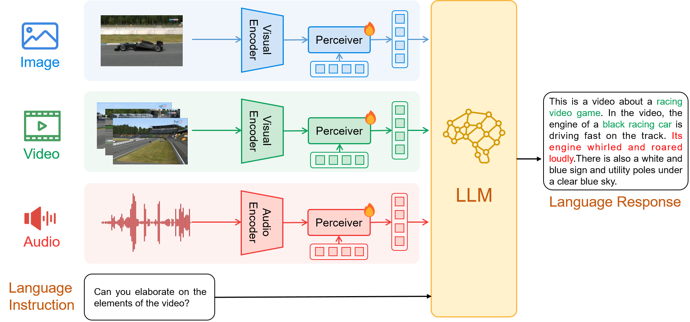

# ChatBridge
 ChatBridge, an approach to learning a unified multimodal model to interpret, correlate, and reason about various modalities without relying on all combinations of paired data.


<a href='https://iva-chatbridge.github.io'></a>  <a href=''></a> 


## Introduction
ChatBridge is a multimodal language model capable of perceiving real-world multimodal information, 
as well as following instructions, thinking, and interacting with humans in natural language.
Inspired by <a href="https://arxiv.org/abs/2204.14198">Flamingo</a> and <a href="https://arxiv.org/abs/2301.12597">BLIP-2</a>, 
we introduce perceiver modules to bridge the encoders and the LLM. 
we choose open-sourced <a href="https://lmsys.org/blog/2023-03-30-vicuna/">Vicuna-13B</a> as the LLM, 
which is built upon LLaMA, and reported to achieve 90% of ChatGPT's quality as per GPT-4's evaluation. 
As for the modal-specific encoders, we choose <a href="https://arxiv.org/abs/2211.07636">EVA-ViT-G</a> as the vision encoder to encode images and videos, 
and <a href="https://arxiv.org/abs/2212.09058">BEAT</a> as the audio encoder to encoder audios.

- Stage 1: Bridge each modality with language, leverage large-scale language-paired two-modality data for multimodal 
    alignment training, including image-text, video-text, and audio-text pairs.
- Stage 2: Multimodal Instruction Tuning, instruction-finetune ChatBridge to align the model with user intent on a 
    multimodal instruction dataset MULTIS, enabling more effective zero-shot generalization on multimodal tasks.

      




## Examples
  <!-- |   |   |
:-------------------------:|:-------------------------:
 |  
  |   -->

More examples can be found in the [project page](https://iva-chatbridge.github.io).


## Getting Started

Code and data will be released in June!


## Acknowledgement

+ [BLIP2](https://huggingface.co/docs/transformers/main/model_doc/blip-2) The model architecture of ChatBridge follows BLIP-2. Don't forget to check this great open-source work if you don't know it before!
+ [Lavis](https://github.com/salesforce/LAVIS) This repository is built upon Lavis!
+ [Vicuna](https://github.com/lm-sys/FastChat) The fantastic language ability of Vicuna with only 13B parameters is just amazing. And it is open-source!
+ [MiniGPT4](https://github.com/Vision-CAIR/MiniGPT-4) and [LLaVA](https://github.com/haotian-liu/LLaVA). We utilize their instruction data and drew inspiration from their approach to design a more comprehensive multimodal instruction dataset. They are all open-source!


If you're using ChatBridge in your research or applications, please cite using this BibTeX:
```bibtex
@article{
}
```


## License
This repository is under [BSD 3-Clause License](LICENSE.md).
Many codes are based on [Lavis](https://github.com/salesforce/LAVIS) with 
BSD 3-Clause License [here](LICENSE_Lavis.md).